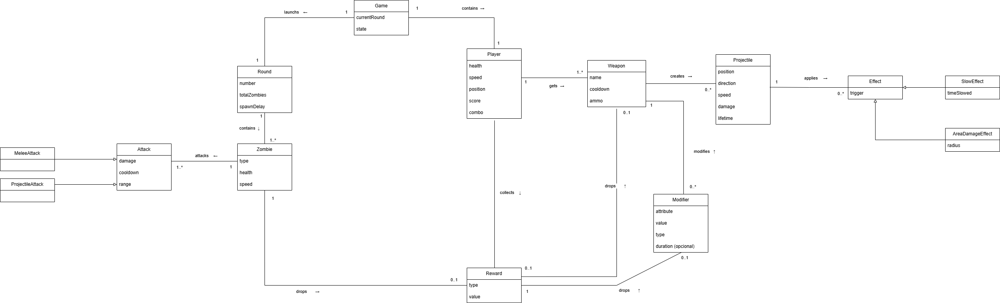

# Zombie Game - Modelo de Dominio

## Descripción general

Este documento describe el **modelo de dominio** del juego *Survival Game*.

El modelo representa las principales entidades conceptuales del sistema y sus relaciones, sin incluir detalles de implementación.

---

## Diagrama

🔗 [Abrir versión editable en draw.io](https://drive.google.com/file/d/1CHCw_L1MZKLddJL5wTsXckYvPSBYzeLq/view?usp=sharing)

---

## Conceptos principales

### Game
Representa una instancia del juego en ejecución.  
Contiene al jugador y gestiona la progresión de rondas.

---

### Player (Jugador)
Representa al personaje controlado por el usuario.  
El jugador puede moverse, utilizar armas y recolectar recompensas.

---

### Weapon (Arma)
Define cómo el jugador realiza ataques.  
Cada arma genera proyectiles al ser utilizada.

---

### Projectile (Proyectil)
Representa cualquier objeto generado por un arma que existe en el mundo del juego.  
Posee daño base y puede aplicar efectos adicionales.  
Al finalizar su ciclo de vida (por impacto o expiración), aplica su daño base y los efectos asociados, si los hubiera.

---

### Effect (Efecto)
Define comportamientos adicionales aplicados por un proyectil, como daño en área o ralentización.  
Los efectos son opcionales y extienden el comportamiento base.

---

### Zombie
Entidad enemiga que aparece durante las rondas.  
Puede recibir daño y puede generar recompensas al ser eliminado.  
Además, posee uno o más ataques que definen cómo interactúa con el jugador.

---

### Attack (Ataque)
Define cómo un zombie realiza daño o interactúa ofensivamente.  
Permite modelar distintos tipos de ataque, como cuerpo a cuerpo, a distancia o en área, sin modificar la clase `Zombie`.

---

### Round (Ronda)
Representa una oleada de enemigos.  
Define la dificultad del juego a través de la cantidad de zombies y el tiempo entre apariciones.

---

### Reward (Recompensa)
Representa un beneficio obtenido por el jugador al eliminar enemigos.  
Se modela de forma genérica, permitiendo representar distintos tipos de beneficios como armas, modificadores, recuperación de vida o munición.

---

### Modifier (Modificador)
Representa una variación sobre atributos como daño, velocidad o tiempo de recarga.  
Actualmente se modela como cambios numéricos y no forma parte de la primera versión jugable.  
El modelo contempla su incorporación futura para permitir la modificación de parámetros o comportamientos de las armas.

---

## Decisiones de diseño

- Los proyectiles poseen daño base, mientras que los **efectos son opcionales**.
- Los efectos se aplican al finalizar el ciclo de vida del proyectil.
- Las recompensas se modelan de forma **genérica**, permitiendo representar distintos tipos de beneficios sin necesidad de múltiples subclases.
- Los modificadores se mantienen simples, con posibilidad de extenderse a comportamientos en el futuro.
- Se introduce la abstracción `Attack` para desacoplar la lógica de ataque de los zombies, permitiendo definir distintos comportamientos sin modificar la entidad principal.
- El modelo está preparado para extender el sistema de efectos mediante nuevas clases que representen comportamientos adicionales.

---